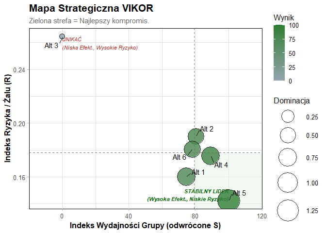

# PaySelectR

<!-- badges: start -->

<!-- badges: end -->

**PaySelectR** to pakiet języka R przeznaczony do wspomagania decyzji
(MCDA) przy wyborze systemów płatności. Pakiet łączy zaawansowane metody
matematyczne z logiką rozmytą, pozwalając na obiektywną ocenę operatorów
płatności na podstawie wielu kryteriów.

## Funkcje pakietu

- **Przygotowanie danych rozmytych** z surowych danych numerycznych
- **Fuzzy MCDA**: Implementacja metod TOPSIS, VIKOR oraz WASPAS w
  wariancie rozmytym (TFN).
- **Best-Worst Method (BWM)**: Obliczanie wag kryteriów na podstawie
  profesjonalnych porównań eksperckich.
- **Meta-Ranking**: Agregacja wyników z wielu metod w jeden stabilny
  ranking konsensusu.
- **Wizualizacja S3**: Intuicyjne mapy strategiczne i wykresy korelacji.

## Instalacja

Możesz zainstalować wersję deweloperską z GitHub:

``` r
# install.packages("devtools")
devtools::install_github("dontdothatb/PaySelectR")
```

## Szybki Start

Oto podstawowy przykład użycia pakietu z wykorzystaniem wbudowanych
danych.

``` r
library(PaySelectR)

# 1. Wczytaj dane
data("pay_select_dane_surowe")
head(pay_select_dane_surowe)
#>   EkspertID         Alternatywa  prowizje integracja_latwosc szybkosc_platnosci bezpieczenstwo
#> 1         1                PayU 1.3627326                  6                  2              8
#> 2         1          Przelewy24 2.8649154                  2                  5              8
#> 3         1              Stripe 1.7269308                  1                  9              8
#> 4         1              PayPal 3.1490522                  2                  7              7
#> 5         1                BLIK 3.3214019                  4                  7              7
#> 6         1 Przelew_Bezposredni 0.6366695                  5                  8              7
#>   obsluga_klienta zasieg_miedzynarodowy akceptacja_transakcji implementacja_latwosc
#> 1               2                     8              96.65773                     5
#> 2               9                     5              97.03635                     8
#> 3               5                     9              98.17684                     2
#> 4              99                     7              99.04306                     6
#> 5               7                     3              96.29401                     2
#> 6               4                     7              99.09734                     4

# 2. Przygotuj macierz rozmytą
skladnia <- "
  Koszty_Finansowe =~ prowizje; 
  Latwosc_Techniczna =~ integracja_latwosc + implementacja_latwosc;
  Jakosc_i_Zasieg =~ szybkosc_platnosci + bezpieczenstwo + obsluga_klienta + zasieg_miedzynarodowy + akceptacja_transakcji
"

macierz <- przygotuj_dane_mcda(
  dane = pay_select_dane_surowe, 
  skladnia = skladnia, 
  kolumna_alternatyw = "Alternatywa" 
)

# 3. Oblicz ranking metodą Fuzzy VIKOR z wagami BWM
wynik_vikor <- rozmyty_vikor(
  macierz, 
  typy_kryteriow = c("min", "max", "max"), 
  bwm_najlepsze = c(8, 3, 1),
  bwm_najgorsze = c(1, 4, 8)
)
#> Obliczanie wag metodą BWM...

# 4. Wyświetl wynik 
print(wynik_vikor$wyniki)
#>   Alternatywa      Def_S     Def_R     Def_Q Ranking
#> 1           1 0.14515360 0.1599259 0.3743246       3
#> 2           2 0.13007834 0.1900849 0.3903515       5
#> 3           3 0.32921100 0.2643265 0.5045715       6
#> 4           4 0.10860980 0.1755952 0.3735648       2
#> 5           5 0.08210813 0.1421481 0.3421120       1
#> 6           6 0.13651595 0.1806003 0.3858482       4
```

## Wizualizacja

Pakiet oferuje profesjonalne mapy decyzyjne:

``` r
# Wizualizacja wyników metody VIKOR (Mapa kompromisu)
plot(wynik_vikor)
```



## Meta-ranking

Agreguj wyniki z wielu metod, aby uzyskać robust ranking konsensusu:

``` r
meta <- rozmyty_meta_ranking(
  macierz,
  typy_kryteriow = c("min", "max", "max"),
  bwm_najlepsze = c(8, 3, 1),
  bwm_najgorsze = c(1, 4, 8)
)
#> Obliczanie wag metodą BWM...
#> Obliczanie wag metodą BWM...
#> Obliczanie wag metodą BWM...

# Pokaż Top 3 rekomendowane systemy płatności
head(meta$porownanie[order(meta$porownanie$Meta_Agregacja), ], 3)
#>           Alternatywa R_VIKOR R_TOPSIS R_WASPAS Meta_Suma Meta_Dominacja Meta_Agregacja
#> 5          Przelewy24       1        1        1         1              1              1
#> 4 Przelew_Bezposredni       2        3        2         2              2              2
#> 1                BLIK       3        2        3         3              3              3
```

## Dokumentacja

Więcej informacji i szczegółowych przykładów znajdziesz w:

- **Vignette**: `vignette("poradnik_mcda", package = "PaySelectR")`
- **Pomoc dla funkcji**: `?rozmyty_vikor`, `?rozmyty_topsis`,
  `?rozmyty_meta_ranking`

## Autorzy

- Zuzanna Moskała

## Licencja

GPL-3
