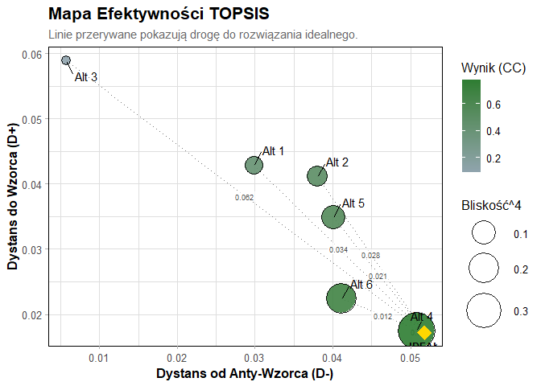
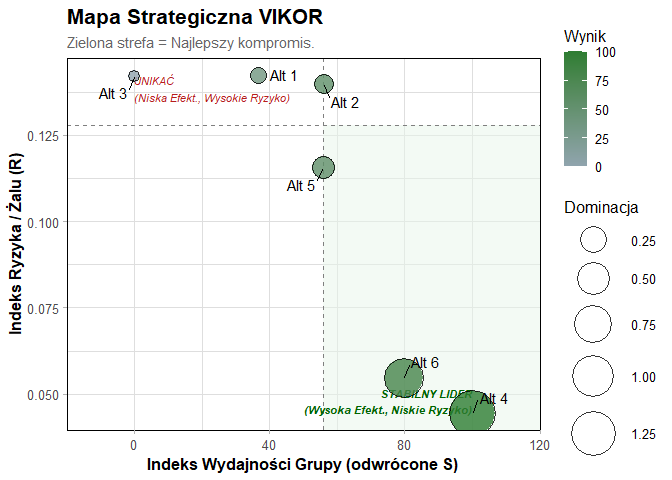

# PaySelectR

<!-- badges: start -->

<!-- badges: end -->

**PaySelectR** to pakiet języka R przeznaczony do wspomagania decyzji
(MCDA) przy wyborze systemów płatności. Pakiet łączy zaawansowane metody
matematyczne z logiką rozmytą, pozwalając na obiektywną ocenę operatorów
płatności na podstawie wielu kryteriów.

## Funkcje pakietu

- **Przygotowanie danych rozmytych** z surowych danych numerycznych
- **Fuzzy MCDA**: Implementacja metod TOPSIS, VIKOR, WASPAS, MULTIMOORA
  oraz PROMETHEE w wariancie rozmytym (TFN).
- **Best-Worst Method (BWM)**: Obliczanie wag kryteriów na podstawie
  profesjonalnych porównań eksperckich.
- **Meta-Ranking**: Agregacja wyników z wielu metod w jeden stabilny
  ranking konsensusu.
- **Wizualizacja S3**: Intuicyjne mapy strategiczne i wykresy korelacji.

## Instalacja

Możesz zainstalować wersję deweloperską z GitHub:

``` r
# install.packages("devtools")
devtools::install_github("dontdothatb/PaySelectR")
```

## Szybki Start

Oto podstawowy przykład użycia pakietu przy użyciu metody Fuzzy TOPSIS.

``` r
library(PaySelectR)

# 1. Wczytaj dane
data("pay_select_dane_surowe")
head(pay_select_dane_surowe)
#>   EkspertID         Alternatywa  prowizje integracja_latwosc szybkosc_platnosci
#> 1         1                PayU 1.3627326                  6                  2
#> 2         1          Przelewy24 2.8649154                  2                  5
#> 3         1              Stripe 1.7269308                  1                  9
#> 4         1              PayPal 3.1490522                  2                  7
#> 5         1                BLIK 3.3214019                  4                  7
#> 6         1 Przelew_Bezposredni 0.6366695                  5                  8
#>   bezpieczenstwo obsluga_klienta zasieg_miedzynarodowy akceptacja_transakcji
#> 1              8               2                     8              96.65773
#> 2              8               9                     5              97.03635
#> 3              8               5                     9              98.17684
#> 4              7              99                     7              99.04306
#> 5              7               7                     3              96.29401
#> 6              7               4                     7              99.09734
#>   implementacja_latwosc
#> 1                     5
#> 2                     8
#> 3                     2
#> 4                     6
#> 5                     2
#> 6                     4

# 2. Przygotuj macierz rozmytą
skladnia <- "
  Koszty_Finansowe =~ prowizje; 
  Latwosc_Techniczna =~ integracja_latwosc + implementacja_latwosc;
  Jakosc_i_Zasieg =~ szybkosc_platnosci + bezpieczenstwo + obsluga_klienta + zasieg_miedzynarodowy + akceptacja_transakcji
"

macierz <- przygotuj_dane_mcda(
  dane = pay_select_dane_surowe, 
  skladnia = skladnia, 
  kolumna_alternatyw = "Alternatywa" 
)

# 3. Wyznacz wagi metodą Entropii
wagi_ent <- oblicz_wagi_entropii(macierz)

# 4. Oblicz ranking metodą Fuzzy TOPSIS
res_topsis <- rozmyty_topsis(
  macierz_decyzyjna = macierz, 
  typy_kryteriow = c("min", "max", "max"), 
  wagi = wagi_ent
)

# 5. Wyświetl wyniki rankingu
summary(res_topsis)
#>        Length Class      Mode     
#> wyniki 5      data.frame list     
#> metoda 1      -none-     character
```

## Wizualizacja

Pakiet `PaySelectR` kładzie duży nacisk na czytelną prezentację wyników.
Dzięki integracji z systemem klas S3, generowanie profesjonalnych
wykresów sprowadza się do jednej komendy `plot()`.

## Metoda Wiodąca: Fuzzy TOPSIS

W procesie wyboru systemu płatności kluczowe jest znalezienie
rozwiązania, które jest najbliższe “idealnemu” (najniższe koszty,
najwyższe bezpieczeństwo). Metoda **TOPSIS** (Technique for Order of
Preference by Similarity to Ideal Solution) mierzy dystans euklidesowy
od teoretycznego wzorca doskonałości.

W pakiecie `PaySelectR` metoda ta została zaimplementowana w logice
rozmytej, co pozwala na uwzględnienie niepewności ocen eksperckich.

``` r
# Obliczenie rankingu metodą Fuzzy TOPSIS
res_topsis <- rozmyty_topsis(
  macierz_decyzyjna = macierz, 
  typy_kryteriow = c("min", "max", "max"), 
  wagi = wagi_ent
)

# Wykres rankingu TOPSIS - ocena bliskości do ideału
plot(res_topsis)
```



### Eksport wyników do formatu naukowego (APA)

W pakiecie zaimplementowano funkcję automatycznie formatującą wyniki
zgodnie z wytycznymi APA, co ułatwia bezpośrednie kopiowanie tabel do
prac naukowych.

``` r

tabela_apa(res_topsis)
```


## Alternatywne Metody Obliczeniowe

Pakiet `PaySelectR` oferuje również inne algorytmy MCDA, co pozwala na
porównanie wyników i wybór najbardziej stabilnego rozwiązania.

Metoda VIKOR skupia się na znalezieniu rozwiązania najbliższego
ideałowi, ale przy jednoczesnej minimalizacji indywidualnego “żalu”
(najgorszego parametru). Jest to idealne podejście, gdy szukamy bramki
płatniczej o najbardziej zrównoważonych parametrach.

``` r
# Obliczenie rankingu metodą Fuzzy VIKOR
res_vikor <- rozmyty_vikor(
  macierz_decyzyjna = macierz, 
  typy_kryteriow = c("min", "max", "max"), 
  wagi = wagi_ent
)

# Wykres rankingu VIKOR - mapa kompromisu
plot(res_vikor)
```



## Meta-ranking

Agreguj wyniki z wielu metod, aby uzyskać robust ranking konsensusu:

``` r
# Wywołanie głównej funkcji agregującej
meta_wynik <- rozmyty_meta_ranking(
  macierz_decyzyjna = macierz,
  typy_kryteriow = c("min", "max", "max"),
  bwm_najlepsze = c(8, 3, 1),
  bwm_najgorsze = c(1, 4, 8)
)
#> Obliczanie wag metodą BWM...
#> Obliczanie wag metodą BWM...
#> Obliczanie wag metodą BWM...
#> Obliczanie wag metodą BWM...
#> Obliczanie wag metodą BWM...

# Przygotowanie tabeli do wyświetlenia
ranking_final <- meta_wynik$porownanie

# Sortowanie według ostatecznej agregacji (Meta_Agregacja)
ranking_top <- ranking_final[order(ranking_final$Meta_Agregacja), ]

# Wyświetlenie tabeli w dokumencie
knitr::kable(
  head(ranking_top, 3), 
  caption = "Tabela 1: Top 3 systemy płatności według rankingu konsensusu"
)
```

|  | Alternatywa | R_VIKOR | R_TOPSIS | R_WASPAS | R_MMOORA | R_PROMETHEE | Meta_Suma | Meta_Dominacja | Meta_Agregacja |
|:---|:---|---:|---:|---:|---:|---:|---:|---:|---:|
| 5 | Przelewy24 | 1 | 1 | 1 | 1 | 1 | 1 | 1 | 1 |
| 4 | Przelew_Bezposredni | 2 | 3 | 2 | 2 | 2 | 2 | 2 | 2 |
| 1 | BLIK | 3 | 2 | 3 | 3 | 5 | 3 | 3 | 3 |

Tabela 1: Top 3 systemy płatności według rankingu konsensusu

## Dokumentacja

Więcej informacji i szczegółowych przykładów znajdziesz w:

- **Vignette**: `vignette("poradnik_mcda", package = "PaySelectR")`
- **Pomoc dla funkcji**: `?rozmyty_vikor`, `?rozmyty_topsis`,
  `?rozmyty_meta_ranking`

## Autorzy

- Zuzanna Moskała

## Licencja

GPL-3
